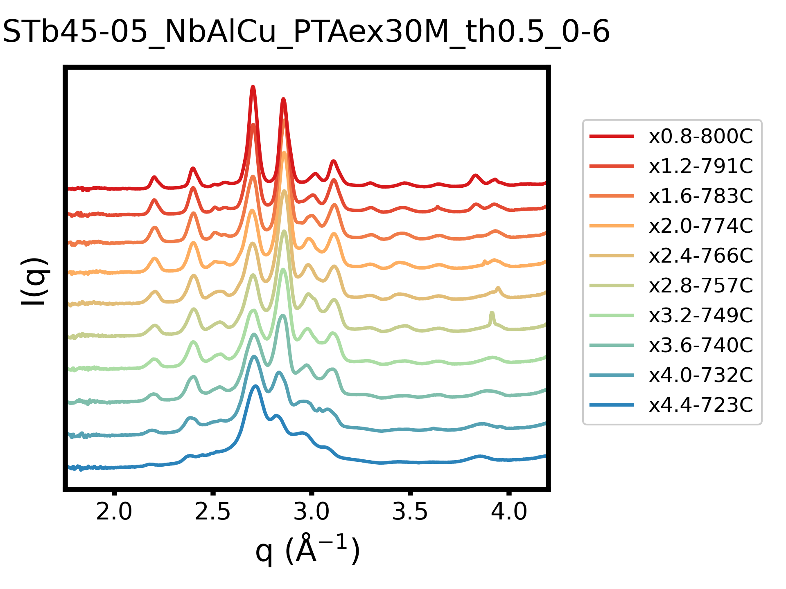

# gixs-viz

A Python visualization and analysis toolkit for **GIWAXS** (Grazing-Incidence Wide-Angle X-ray Scattering) and **GISAXS** (Grazing-Incidence Small-Angle X-ray Scattering) data collected at the CMS beamline.

---

## Features

- **GIWAXS** — plot 1D intensity profiles (I vs. q), with optional polynomial background subtraction
- **GISAXS** — plot data in multiple analysis modes:
  - `Intensity` — raw I(q) on a log scale
  - `Guinier` — ln[I] vs. q² with automatic linear fit and Rg extraction
  - `Guinier Peak` — ln[qI] vs. q² for Guinier–Porod analysis
  - `Peak Enhanced` — qI vs. q on a log–log scale
  - `Kratky plot` — q²I vs. q on a log–log scale
  - `Paper` — log–log I(q) for publication-ready figures
- Automatic **Guinier region fitting** (iteratively enforces 0.9 ≤ qRg ≤ 1.3)
- Polynomial **background subtraction** via `peakutils`
- **Export to Jade** — writes q and 2θ `.xy` files for phase identification
- Configurable color palettes, y-offsets, axis ranges, and legend labels via `.ini` files
- Handles `.dat` (CMS native) and `.xy` (Dioptas) file formats with robust multi-encoding support

---

## Requirements

```
pandas
numpy
scipy
matplotlib
palettable
peakutils
colorama
```

Install dependencies using your preferred package manager:

```bash
# uv (fastest, pip-compatible)
uv add pandas numpy scipy matplotlib palettable peakutils colorama

# pixi (conda-forge + PyPI, fully reproducible)
pixi add pandas numpy scipy matplotlib palettable peakutils colorama

# conda/mamba + pip (palettable and peakutils are not on conda-forge)
conda install -c conda-forge pandas numpy scipy matplotlib
pip install palettable peakutils colorama

# plain pip
pip install pandas numpy scipy matplotlib palettable peakutils colorama
```

> **Note:** The script currently imports `torch` (`from torch.backends.quantized import engine`), but this is unused. PyTorch is not required for core functionality.

---

## Usage

### 1. Set your data path and config file

Edit the top of `CMS_GIWAXS_and_GISAXS.py`:

```python
INPUT_PATH = r"path\to\your\data\folder"
CONFIG_FILE = r"path\to\your\config.ini"
```

### 2. Configure your run via the `.ini` file

Copy `CMS_plot_config.ini` and edit it for your sample. Key settings:

| Section | Key | Description |
|---|---|---|
| `[samples]` | `pattern` | File extension to match (`.dat` or `.xy`) |
| `[samples]` | `angle_range` | `'wide'` for GIWAXS, `'small'` for GISAXS |
| `[samples]` | `sample_list` | Indices of scans to plot, e.g. `[0, 1, 2]` |
| `[legends]` | `sample_label` | Custom legend labels, or `[]` for auto |
| `[format]` | `palette` | Color palette from `palettable` |
| `[format]` | `offset` | Vertical offset between curves |
| `[format]` | `xrange` / `yrange` | Axis limits, e.g. `(0.3, 3.6)` |
| `[data_processing]` | `bgsub_degree` | Polynomial degree for background subtraction (`0` to skip) |
| `[data_processing]` | `gisaxs_mode` | GISAXS plot mode (see Features above) |
| `[data_processing]` | `first_datapoint` | First data index to exclude beam stop region |

### 3. Run the script

```bash
python CMS_GIWAXS_and_GISAXS.py
```

Set `IF_SAVE = True` in the script to save the output figure as a `.png` next to the config file.  
Set `OUTPUT_FOR_JADE = True` to also export `.xy` files for Jade phase identification.

---

## File Naming Convention

The script expects CMS beamline filenames that encode scan metadata, for example:

```
b58-04-ScVMnSc-AE_pos1_th0.100_5.00s_100_maxs.dat
```

Fields are parsed automatically for batch number, composition, condition, and incident angle when building plot legends.

---

## Output

- **Plots** — saved as `.png` at 300 dpi next to the config file (when `IF_SAVE = True`)
- **Jade files** — saved to `Output_files_<config_stem>/` inside the data directory (when `OUTPUT_FOR_JADE = True`), containing both q-space and 2θ columns

---

## Examples

### GIWAXS — waterfall plot (NbAlCu, 10 annealing temperatures)


### GISAXS — Peak Enhanced mode (NbAl, 4 annealing conditions)


---

## Author

Cheng-Chu Chung — Stony Brook University
